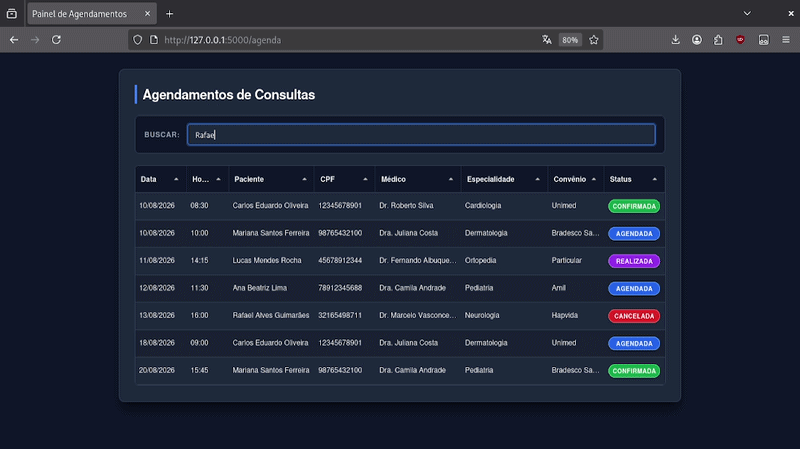

# 🩺 Agenda Médica Web


Uma aplicação web moderna para gestão e visualização de agendamentos médicos, desenvolvida em Python (Flask) e PostgreSQL, totalmente conteinerizada com Docker.

---

## 📝 Descrição Breve

A **Agenda Médica Web** é uma solução intuitiva projetada para otimizar o fluxo de agendamento e acompanhamento de consultas. O sistema abrange:
- **Autenticação Segura:** Login e registro de usuários com hash de senha via Werkzeug e proteção contra vulnerabilidades CSRF.
- **Painel Dinâmico:** Visualização interativa dos agendamentos através de tabelas reativas com filtragem instantânea sem reload.
- **Integração via API RESTful:** Endpoints expostos para busca e integração com systems externos.
- **Povoamento Automático (*Seeding*):** Inicialização do banco de dados com massa de testes pronta para validação imediata.

---

## 🎬 Demonstração da Aplicação

Confira abaixo o funcionamento da interface, navegação e busca reativa da aplicação:




---

## 🛠️ Tecnologias Utilizadas

| Camada | Tecnologias / Bibliotecas |
| :--- | :--- |
| **Backend** | Python 3.11, Flask, Flask-SQLAlchemy (ORM), Flask-WTF / WTForms, Werkzeug |
| **Banco de Dados** | PostgreSQL 15, Driver `psycopg2-binary` |
| **Frontend** | HTML5, CSS3, JavaScript (Vanilla ES6+), **Tabulator.js** |
| **Infraestrutura** | Docker, Docker Compose |

---

## 🔐 Configuração das Variáveis de Ambiente (`.env`)

Antes de executar a aplicação, ajuste as variáveis de ambiente necessárias:

1. Localize o arquivo de exemplo `env-example` (ou `.env.example`) na raiz do repositório ou no diretório `AgendaMedica/`.
2. Renomeie o arquivo para `.env`:
   - **Linux / macOS:**
     ```bash
     mv AgendaMedica/env-example AgendaMedica/.env
     ```
   - **Windows (PowerShell):**
     ```powershell
     Rename-Item AgendaMedica/env-example AgendaMedica/.env
     ```

---

## 🔑 Como Gerar uma `SECRET_KEY` Segura (Ambiente Virtual)

Para alterar a `SECRET_KEY` do arquivo `.env` por uma chave criptográfica forte, utilize um ambiente virtual temporário:

### 🐧 Linux / macOS:

```bash
# 1. Crie e ative o ambiente virtual
python3 -m venv .venv
source .venv/bin/activate

# 2. Gerar a chave secreta de 64 caracteres hexadecimais
python3 -c "import secrets; print(secrets.token_hex(32))"

# 3. Desative o ambiente virtual
deactivate
```

### 🪟 Windows (PowerShell):

```powershell
# 1. Crie e ative o ambiente virtual
python -m venv .venv
.\.venv\Scripts\Activate.ps1

# 2. Gerar a chave secreta
python -c "import secrets; print(secrets.token_hex(32))"

# 3. Desative o ambiente virtual
deactivate
```

> **Nota para PowerShell:** Caso receba erro de execução de scripts, rode antes:  
> `Set-ExecutionPolicy Unrestricted -Scope Process`

---

## 🐳 Instruções para Executar o Projeto com Docker

### Pré-requisitos
- [Docker Engine](https://docs.docker.com/get-docker/) e [Docker Compose](https://docs.docker.com/compose/install/) instalados.

### Passo a Passo

1. **Clone o repositório:**
   ```bash
   git clone https://github.com/RageHTML/Agenda_Medica_TimerSaver.git
   cd Agenda_Medica_TimerSaver
   ```

2. **Configure o arquivo de ambiente:**
   Certifique-se de que o arquivo `.env` foi criado a partir do `env-example`.

3. **Suba os containers com Docker Compose:**
   ```bash
   docker compose up --build
   ```
   *(O Docker criará os serviços do PostgreSQL e do Flask, aplicando as migrações/seed automaticamente).*

4. **Acesse no navegador:**
   - **Painel Principal:** [http://localhost:5000/agenda](http://localhost:5000/agenda)
   - **Tela de Login:** [http://localhost:5000/login](http://localhost:5000/login)

5. **Para encerrar e remover os containers:**
   ```bash
   docker compose down
   ```

---

## 🌱 Povoamento do Banco de Dados (*Database Seeding*)

O sistema conta com um comando dedicado para popular o banco de dados com massa de testes. 

Para executá-lo manualmente, certifique-se de estar posicionado no **mesmo diretório onde se encontra o arquivo `app.py`** e com o seu ambiente virtual ativado, em seguida utilize o comando do Flask:

```
flask seed
```

---

## 🔑 Credenciais do Usuário de Teste

Com o povoamento automático (*seeding*) executado na inicialização da aplicação, utilize qualquer uma das credenciais abaixo para testar a autenticação:

| Perfil | E-mail | Senha |
| :--- | :--- | :--- |
| **Paciente 1** | `carlos.eduardo@gmail.com` | `123456` |
| **Paciente 2** | `mariana.santos@hotmail.com` | `123456` |
| **Paciente 3** | `lucas.mendes@yahoo.com.br` | `123456` |

---

O que acontece quando você copia e cola o bloco de código do Markdown aqui do chat para o seu arquivo `.md` é que o próprio texto de parágrafo gerado dentro da caixa de código acaba ficando com quebras manuais de linha (`\n`) que o editor do chat insere para caber na tela.

Para resolver isso de forma definitiva e garantir que o texto seja um **parágrafo contínuo** (que flui naturalmente e se ajusta sozinho na tela do seu editor), a melhor forma é gerar o texto fora da caixa de código tradicional, ou fornecê-lo em blocos de texto limpo.

Aqui está o texto do README perfeitamente formatado e sem quebras indesejadas no meio das frases. Basta selecionar e copiar direto daqui:

---

## 🧪 Testes Automatizados

O projeto conta com uma suíte de testes automatizados utilizando Pytest e o cliente de testes integrado do Flask (app.test_client()), simulando requisições HTTP e operando sobre um banco de dados relacional em memória (SQLite em memória).

### 🚀 Como Executar os Testes

1. Certifique-se de que o ambiente virtual está ativado no seu terminal.
2. Execute o comando do pytest com a flag -s para visualizar os logs detalhados de cada etapa:

```bash
pytest -s

```

---

### 📋 O que cada teste faz

| Nome do Teste | Comportamento Validado |
| --- | --- |
| **test_login_valido** | Simula uma requisição POST na rota de login utilizando credenciais corretas e valida se a resposta HTTP retorna código 200 com sucesso. |
| **test_login_invalido** | Simula uma tentativa de autenticação com senha incorreta, validando que o sistema intercepta a falha e recusa o acesso corretamente. |
| **test_api_agendamentos_com_dados** | Popula o banco em memória com uma massa inicial de testes e consome o endpoint RESTful (GET /api/agendamentos), conferindo a integridade, o status e o mapeamento dos dados retornados. |

---

## 💡 Exemplos de Uso da Aplicação

1. **Autenticação de Usuários (`/login` e `/register`):**
   - Validação de formulários e senhas armazenadas como hash seguro via Werkzeug (`generate_password_hash`).
   - Proteção CSRF ativa em todas as requisições de formulário.

2. **Tabela Dinâmica de Consultas (`/agenda`):**
   - Renderização reativa utilizando a biblioteca **Tabulator.js**.
   - Badges visuais indicando o status das consultas (*Agendada*, *Confirmada*, *Realizada*, *Cancelada*).

3. **Busca Reativa com Debounce:**
   - Campo de busca em tempo real com técnica de **Debounce (300ms)** em JS para otimização de chamadas ao backend.
   - Suporte a filtros combinados: Nome do Paciente, CPF, Médico ou Especialidade.

4. **API RESTful de Agendamentos (`GET /api/agendamentos`):**
   - Obter todos os agendamentos (JSON):
     ```http
     GET http://localhost:5000/api/agendamentos
     ```
   - Filtrar agendamentos por termo de busca:
     ```http
     GET http://localhost:5000/api/agendamentos?q=Cardiologia
     ```

---

## 📐 Decisões Técnicas e Limitações Conhecidas

### Decisões Técnicas
- **Isolamento de Porta PostgreSQL:** Mapeamento da porta externa do banco para `5433:5432` no `docker-compose.yml`, evitando conflitos com instâncias locais do Postgres na máquina do desenvolvedor.
- **Comunicação Interna de Containers:** O Flask conecta-se ao banco via DNS da rede interna Docker (`db:5432`), abstraindo IPs voláteis.
- **Prevenção de Cache de Assets (Cache-Busting):** Função utilitária no Flask injetando parâmetros de timestamp (`?v=TIMESTAMP`) em arquivos CSS/JS estáticos.

### Limitações Conhecidas
- **Sessões Locais em Cookie:** Uso de *session cookies* nativos do Flask. Em cenários de escalabilidade horizontal com múltiplas instâncias, recomenda-se integrar o **Redis** como backend de sessão.
- **Execução do Seed no Boot:** O comando de *seed* é disparado durante a subida do container da aplicação web. Para ambientes produtivos, o povoamento deve ser isolado na esteira de CI/CD para evitar *race conditions*.